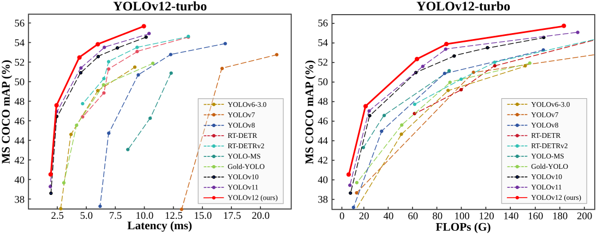

<div align="center">
<h1>YOLOv12</h1>
<h3>YOLOv12: Attention-Centric Real-Time Object Detectors</h3>

[Yunjie Tian](https://sunsmarterjie.github.io/)<sup>1</sup>, [Qixiang Ye](https://people.ucas.ac.cn/~qxye?language=en)<sup>2</sup>, [David Doermann](https://cse.buffalo.edu/~doermann/)<sup>1</sup>

<sup>1</sup>  University at Buffalo, SUNY, <sup>2</sup> University of Chinese Academy of Sciences.


<p align="center">
   <br>
  Comparison with popular methods in terms of latency-accuracy (left) and FLOPs-accuracy (right) trade-offs
</p>

</div>

[](https://arxiv.org/abs/2502.12524) [](https://huggingface.co/spaces/sunsmarterjieleaf/yolov12) <a href="https://colab.research.google.com/github/roboflow-ai/notebooks/blob/main/notebooks/train-yolov12-object-detection-model.ipynb"></a> [](https://www.kaggle.com/code/jxxn03x/yolov12-on-custom-data) [](https://blog.roboflow.com/use-yolov12-with-roboflow/#deploy-yolov12-models-with-roboflow)

## Updates

- 2025/03/09: **YOLOv12-turbo** is released: a faster YOLOv12 version.

- 2025/02/24: Some blog introductions: [ultralytics](https://docs.ultralytics.com/models/yolo12/), [LearnOpenCV](https://learnopencv.com/yolov12/), [Medium@Mert](https://medium.com/@Mert.A/how-to-use-yolov12-for-object-detection-a93b3c2592a3). Thanks to them!

- 2025/02/22: [YOLOv12 TensorRT CPP Inference Repo + Google Colab Notebook Support](https://github.com/mohamedsamirx/YOLOv12-TensorRT-CPP).

- 2025/02/22: [Android deploy](https://github.com/mpj1234/ncnn-yolov12-android/tree/main). [TensorRT-YOLO](https://github.com/laugh12321/TensorRT-YOLO) accelerates yolo12 inference. Thanks to them!

- 2025/02/21: Try yolo12 for classification, oriented bounding boxes, pose estimation, and instance segmentation at [ultralytics](https://github.com/ultralytics/ultralytics/tree/main/ultralytics/cfg/models/12). Please pay attention to this [issue](https://github.com/sunsmarterjie/yolov12/issues/29). Thanks to them! 

- 2025/02/20: [Any computer or edge device?](https://github.com/roboflow/inference) Support yolo12 now.  
  
- 2025/02/20: [ONNX CPP Version](https://github.com/mohamedsamirx/YOLOv12-ONNX-CPP). Train a yolov12 model on a custom dataset: [Blog](https://blog.roboflow.com/train-yolov12-model/) and [Youtube](https://www.youtube.com/watch?v=fksJmIMIfXo). [Train YOLO12 on a custom dataset step-by-step](https://youtu.be/dO8k5rgXG0M) by [Noor](https://github.com/noorkhokhar99).

- 2025/02/19: [arXiv version](https://arxiv.org/abs/2502.12524) is public. [Demo](https://huggingface.co/spaces/sunsmarterjieleaf/yolov12) is available (try [Demo2](https://huggingface.co/spaces/sunsmarterjieleaf/yolov12_demo2) [Demo3](https://huggingface.co/spaces/sunsmarterjieleaf/yolov12_demo3) if busy).


<details>
  <summary>
  <font size="+1">Abstract</font>
  </summary>
Enhancing the network architecture of the YOLO framework has been crucial for a long time but has focused on CNN-based improvements despite the proven superiority of attention mechanisms in modeling capabilities. This is because attention-based models cannot match the speed of CNN-based models. This paper proposes an attention-centric YOLO framework, namely YOLOv12, that matches the speed of previous CNN-based ones while harnessing the performance benefits of attention mechanisms.

YOLOv12 surpasses all popular real-time object detectors in accuracy with competitive speed. For example, YOLOv12-N achieves 40.6% mAP with an inference latency of 1.64 ms on a T4 GPU, outperforming advanced YOLOv10-N / YOLOv11-N by 2.1%/1.2% mAP with a comparable speed. This advantage extends to other model scales. YOLOv12 also surpasses end-to-end real-time detectors that improve DETR, such as RT-DETR / RT-DETRv2: YOLOv12-S beats RT-DETR-R18 / RT-DETRv2-R18 while running 42% faster, using only 36% of the computation and 45% of the parameters.
</details>


## Main Results

**Turbo (default version)**:
| Model                                                                                | size<br><sup>(pixels) | mAP<sup>val<br>50-95 | Speed<br><sup>T4 TensorRT10<br> | params<br><sup>(M) | FLOPs<br><sup>(G) |
| :----------------------------------------------------------------------------------- | :-------------------: | :-------------------:| :------------------------------:| :-----------------:| :---------------:|
| [YOLO12n](https://github.com/sunsmarterjie/yolov12/releases/download/turbo/yolov12n.pt) | 640                   | 40.4                 | 1.60                            | 2.5                | 6.0               |
| [YOLO12s](https://github.com/sunsmarterjie/yolov12/releases/download/turbo/yolov12s.pt) | 640                   | 47.6                 | 2.42                            | 9.1                | 19.4              |
| [YOLO12m](https://github.com/sunsmarterjie/yolov12/releases/download/turbo/yolov12m.pt) | 640                   | 52.5                 | 4.27                            | 19.6               | 59.8              |
| [YOLO12l](https://github.com/sunsmarterjie/yolov12/releases/download/turbo/yolov12l.pt) | 640                   | 53.8                 | 5.83                            | 26.5               | 82.4              |
| [YOLO12x](https://github.com/sunsmarterjie/yolov12/releases/download/turbo/yolov12x.pt) | 640                   | 55.4                 | 10.38                           | 59.3               | 184.6             |

[**v1.0**](https://github.com/sunsmarterjie/yolov12/tree/V1.0):
| Model                                                                                | size<br><sup>(pixels) | mAP<sup>val<br>50-95 | Speed<br><sup>T4 TensorRT10<br> | params<br><sup>(M) | FLOPs<br><sup>(G) |
| :----------------------------------------------------------------------------------- | :-------------------: | :-------------------:| :------------------------------:| :-----------------:| :---------------:|
| [YOLO12n](https://github.com/sunsmarterjie/yolov12/releases/download/v1.0/yolov12n.pt) | 640                   | 40.6                 | 1.64                            | 2.6                | 6.5               |
| [YOLO12s](https://github.com/sunsmarterjie/yolov12/releases/download/v1.0/yolov12s.pt) | 640                   | 48.0                 | 2.61                            | 9.3                | 21.4              |
| [YOLO12m](https://github.com/sunsmarterjie/yolov12/releases/download/v1.0/yolov12m.pt) | 640                   | 52.5                 | 4.86                            | 20.2               | 67.5              |
| [YOLO12l](https://github.com/sunsmarterjie/yolov12/releases/download/v1.0/yolov12l.pt) | 640                   | 53.7                 | 6.77                            | 26.4               | 88.9              |
| [YOLO12x](https://github.com/sunsmarterjie/yolov12/releases/download/v1.0/yolov12x.pt) | 640                   | 55.2                 | 11.79                           | 59.1               | 199.0             |

## Installation
```
wget https://github.com/Dao-AILab/flash-attention/releases/download/v2.7.3/flash_attn-2.7.3+cu11torch2.2cxx11abiFALSE-cp311-cp311-linux_x86_64.whl
conda create -n yolov12 python=3.11
conda activate yolov12
pip install -r requirements.txt
pip install -e .
```

## Validation
[`yolov12n`](https://github.com/sunsmarterjie/yolov12/releases/download/v1.0/yolov12n.pt)
[`yolov12s`](https://github.com/sunsmarterjie/yolov12/releases/download/v1.0/yolov12s.pt)
[`yolov12m`](https://github.com/sunsmarterjie/yolov12/releases/download/v1.0/yolov12m.pt)
[`yolov12l`](https://github.com/sunsmarterjie/yolov12/releases/download/v1.0/yolov12l.pt)
[`yolov12x`](https://github.com/sunsmarterjie/yolov12/releases/download/v1.0/yolov12x.pt)

```python
from ultralytics import YOLO

model = YOLO('yolov12{n/s/m/l/x}.pt')
model.val(data='coco.yaml', save_json=True)
```

## Training 
```python
from ultralytics import YOLO

model = YOLO('yolov12n.yaml')

# Train the model
results = model.train(
  data='coco.yaml',
  epochs=600, 
  batch=256, 
  imgsz=640,
  scale=0.5,  # S:0.9; M:0.9; L:0.9; X:0.9
  mosaic=1.0,
  mixup=0.0,  # S:0.05; M:0.15; L:0.15; X:0.2
  copy_paste=0.1,  # S:0.15; M:0.4; L:0.5; X:0.6
  device="0,1,2,3",
)

# Evaluate model performance on the validation set
metrics = model.val()

# Perform object detection on an image
results = model("path/to/image.jpg")
results[0].show()

```

## Prediction
```python
from ultralytics import YOLO

model = YOLO('yolov12{n/s/m/l/x}.pt')
model.predict()
```

## Export
```python
from ultralytics import YOLO

model = YOLO('yolov12{n/s/m/l/x}.pt')
model.export(format="engine", half=True)  # or format="onnx"
```


## Demo

```
python app.py
# Please visit http://127.0.0.1:7860
```


## Acknowledgement

The code is based on [ultralytics](https://github.com/ultralytics/ultralytics). Thanks for their excellent work!

## Citation

```BibTeX
@article{tian2025yolov12,
  title={YOLOv12: Attention-Centric Real-Time Object Detectors},
  author={Tian, Yunjie and Ye, Qixiang and Doermann, David},
  journal={arXiv preprint arXiv:2502.12524},
  year={2025}
}
```

# 番茄检测模型修复方案

## 问题分析

我们对番茄检测模型遇到的问题进行了深入分析，发现关键的数据管道故障导致了训练失败。具体来说，问题主要集中在以下几个方面：

1. **数据加载问题**：在数据处理流程中，7列标签格式（含两个辅助属性：h_rel和cluster_ids）在数据增强过程中没有被正确处理和传递。

2. **数据变换问题**：在数据增强操作中，额外的列信息（h_rel和cluster_ids）在流转过程中丢失。

3. **实例化处理**：Instances类没有完全支持这两个辅助字段，导致在变换之后信息丢失。

4. **格式化处理**：Format类负责最终将标签格式化为模型可用的格式，但它没有处理h_rel和cluster_ids字段。

5. **损失函数计算**：TomatoDetectWithRankLoss在计算排序损失时没有足够的健壮性检查，缺少容错机制。

## 修复方案

我们对关键代码模块实施了以下修改：

### 1. dataset.py - TomatoYOLODataset类

- 修改了初始化方法，确保正确设置has_cluster_id和has_h_rel标志
- 增强了build_transforms方法，确保Format变换知道要保留额外属性
- 改进了__getitem__方法，确保返回的数据包含所需的所有字段
- 完善了update_labels_info方法，确保标签处理过程中保留辅助属性
- 增强了collate_fn方法，处理batch数据的正确拼接

### 2. augment.py - Format类

- 添加了return_tomato_attrs参数，用于控制是否返回番茄特有属性
- 修改了__call__方法，确保在整个数据处理流程中正确处理cluster_ids和h_rel
- 添加了更健壮的错误处理，避免因属性缺失导致异常

### 3. instance.py - Instances类

- 扩展了Instances类，使其能够存储和处理cluster_ids和h_rel属性
- 修改了各种变换方法（scale, normalize, denormalize等），确保在操作过程中保留这些属性
- 增强了update方法，支持更新这些新添加的属性

### 4. loss.py - TomatoDetectWithRankLoss类

- 增强了错误处理和日志记录，使得问题更容易诊断
- 添加了更详细的数据完整性检查，防止在缺少必要数据时崩溃
- 优化了排序损失计算逻辑，增加了对无效数据的过滤
- 减少了不必要的调试日志，只在debug模式下输出详细信息

## 实现细节

1. **数据流正确性**：确保从数据加载、预处理、增强直到传入模型的整个流程中，7列标签格式的完整性被保持。

2. **健壮性增强**：添加了必要的错误检查和容错机制，确保即使数据不完整，模型依然能够进行训练。

3. **保持兼容性**：所有修改都与原有的YOLOv12框架保持兼容，不影响其他模型的使用。

## 使用方法

修复后的代码能够正确处理7列标签格式，支持番茄串检测和排序损失计算。只需确保标签文件使用正确的格式：

```
class_id x_center y_center width height cluster_id h_rel
```

其中：
- class_id：类别ID
- x_center, y_center, width, height：归一化的边界框坐标
- cluster_id：番茄串ID
- h_rel：相对高度（0-1之间，0表示最高位置）

